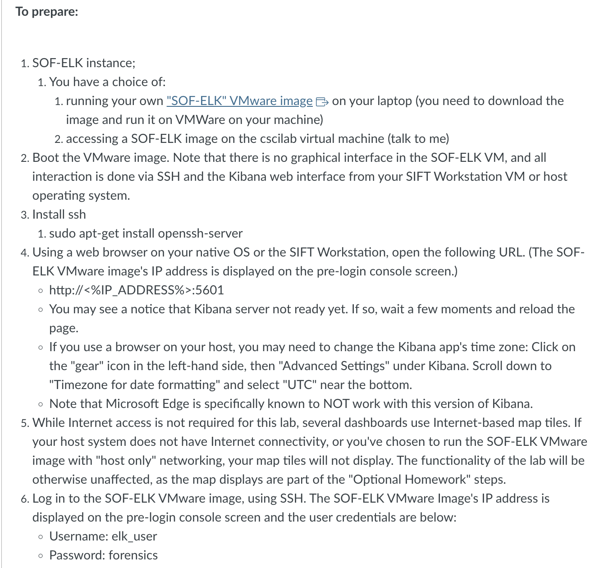
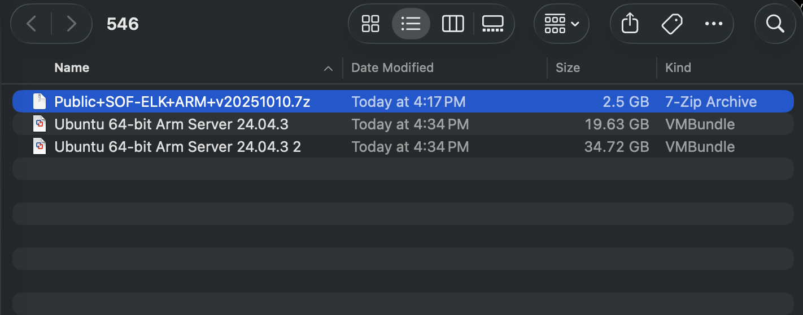
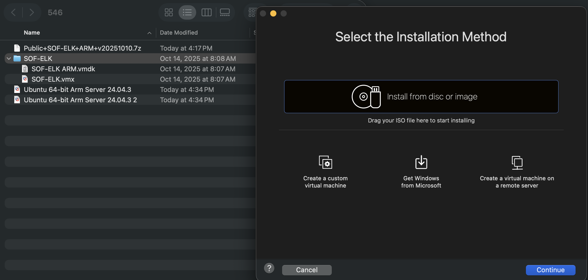
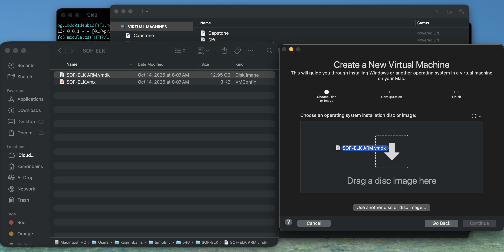
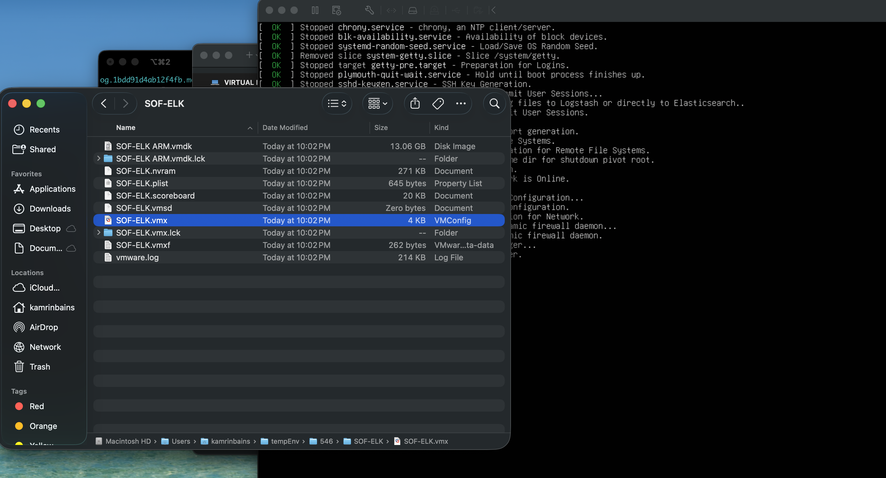
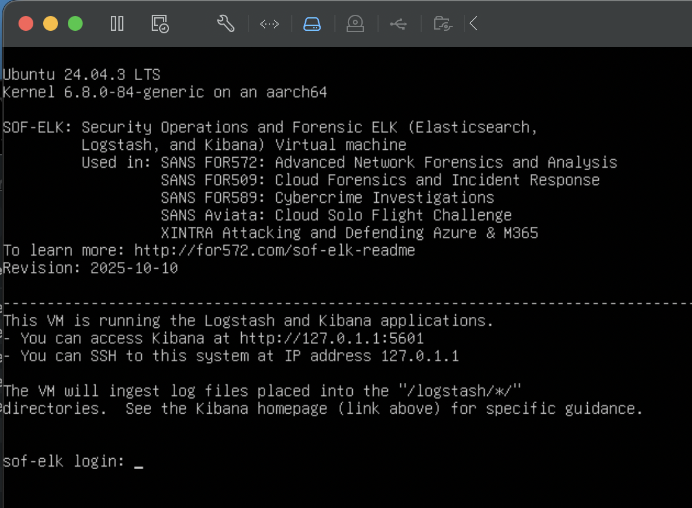

# SOF-ELK Installation
To begin, I am in a class called Network Forensics. We had been instructed to download and install a tool called SOF-ELK, that is used specifcally for security monitoring and forensic analysis. We were given specific instructions on how to perform this installation and setup of the vm (virtual machine) that would host this tool. 

 
Here I followed the link to the github repository and downloaded the version for my system. 

After extracting the vm image, I opened up VMware Fusion to start the setup process. 
When trying to add a new vm image, the best understood way is to click the add icon. That is the most **effective** way to install a new image, whether you have an installation file or need to get one. 

Through my own **experience** with vmware, I knew that clicking continue would not harm/hold me back or my progress in any way.
Here there is no clear way of adding the vm image with the files that were in the provided zip file, that is with the add icon for VMware fusion.

Through trial and error, it seemed that the last effort I could make would be trying to utilize the other file that was contained in the zip. This was the VMConfig file. I double clicked the file and it booted up and loaded this the correct way.

After booting into the vm image, we get the correct login screen.

Looking at this through a UX (User Experience) perspective, the task at hand was completed, which was the installation of SOF-ELK. So in hand, utilizing the VMware Fusion was **effective**. Was the installation process easy/fast? In my opinion, no it was not as fast as it should have been as instructions were not clear. Mainly, I am referring to the installation process using VMware Fusion was not clear. VMware Fusion has an icon for adding new vm images, that allows you to use an iso file for a fast and clean installation. When navigating the installation, it allows you to add the disk image, though it did not allow me to add the one from the SOF-ELK zip folder. So if it were more clear, an error like that wouldn't have occurred. In the grand scheme of things, I didn't even need to use the add button for a new vm image, as all I needed to do was double click my config file for SOF-ELK and it worked correctly. This would have been more **efficient** if it were listed anywhere or described to the user that they could use the config file to boot right into the vm without adding it to the Virtual Machines Library. Overall, this interaction could have been more **satisfying** if it was communicated that I could use the VMconfig file to boot directly in. There would have been less mistakes and trial and error to learn how to have a better user experience.
